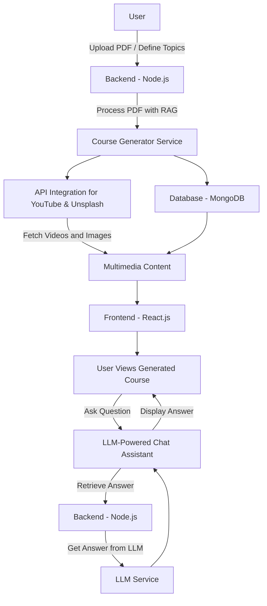

# Course.io - AI-Powered Personalized Course Generator

**Course.io** is an innovative platform that creates tailored courses for users by leveraging AI, multimedia content, and user-provided documents (such as PDFs). The platform integrates videos from YouTube, images from Unsplash, and text content to generate personalized learning materials. Additionally, each course comes with an LLM-powered chat assistant, which allows users to ask questions related to the specific topics in the course and receive real-time answers.

## Features

- **Automated Course Generation:** Users can create courses based on predefined topics or upload PDFs, which are then transformed into structured, interactive learning materials.
- **Multimedia Integration:** Courses are enriched with relevant YouTube videos, Unsplash images, and AI-generated text to provide a comprehensive learning experience.
- **PDF-to-Course Feature:** Upload PDFs, and the platform extracts key information to generate courses based on the document’s content.
- **Real-Time Assistance:** Each course includes a built-in chat assistant powered by a Large Language Model (LLM), which provides instant, context-aware answers to user questions.
- **User-Driven Learning Paths:** Users can create custom courses or follow predefined learning paths.

## Installation

### Prerequisites

Ensure you have the following installed:

- [Node.js](https://nodejs.org/) (v14 or higher)
- [npm](https://www.npmjs.com/)

### Steps

1. Clone the repository:

   ```bash
   git clone https://github.com/SabariKameswaran/Course.io-Intel-Hackathon.git
   ```
2.Navigate into the project directory:
  ```bash
  cd Course.io-Intel-Hackathon
```
3.Install dependencies:
```bash
npm install
```
4.Create an env file:
Create a .env file in the backend directory and add the following environment variables:
```bash
PORT=5000
MONGODB_URI=<your_uri>
WEBSITE_URL='http://localhost:3000'
LOGO=<Logo_link_through_firebase>
COMPANY=<your_company_name>
API_KEY=<gemini_ai_api_key>
EMAIL=<mailid_used_to_create_app_in_google_console>
PASSWORD=<password_given_by_googel_app>
UNSPLASH_ACCESS_KEY=<your_api>
```
5.Start the Developement Server:
```bash
cd server
node server.js
```
6.Start the Application:
```bash
npm start
```
7.Open in a Browser:'
```bash
http://localhost:3000
```

## Project Structure
- /src: Contains all React components and business logic.
- /public: Public assets such as images and the main HTML file.
- /server: Server-side code to manage backend operations.
- /build: Build directory for production.

## Technologies Used
- React.js: Front-end library for building user interfaces.
- Node.js: Backend runtime for server-side logic.
- Tailwind CSS: For rapid UI development with responsive design.
- Express.js: Minimalist framework for backend routing.
- MongoDB: (If applicable) Database for storing application data.
- AI Models: Large Language Model (LLM) for chat functionality, Retrieval-Augmented Generation (RAG) for PDF processing and course creation
- Multimedia APIs:
    YouTube API: To fetch relevant videos.
    Unsplash API: To fetch related images.

  ## Usage
  - **1.Course Generation:**
      - Navigate to the frontend at http://localhost:3000.
      - Enter topics or upload a PDF to generate a new course.
      - The system will automatically pull in relevant multimedia resources (videos and images) and create a structured course.
   - **2.Real Time Assistance:**
      - During the course, use the integrated chat system to ask questions related to any topic or subtopic.
      - The AI-powered chat will respond with detailed answers in real time, providing additional learning support.
   - **3.PDF Upload:**
      - Upload a PDF document, and the system will extract content to build a course based on the material provided.
   - **4.Personalized Learning:**
      - Customize your learning path based on the topics you wish to explore, and the platform will generate a detailed course for you.

  ## Flow Chart



### **Flowchart Explanation**:

1. **User Interaction**:
   - Users either upload a PDF or define course topics and subtopics.
   
2. **Backend Processing**:
   - The **Node.js backend** processes the PDF using **Retrieval-Augmented Generation (RAG)** to extract relevant content.
   - The **Course Generator** service structures the content, including topics and subtopics, and stores this in the **MongoDB** database.

3. **Multimedia Integration**:
   - The backend integrates with the **YouTube API** and **Unsplash API** to fetch relevant multimedia content (videos and images) to enrich the course.

4. **Frontend**:
   - The **React.js frontend** renders the course for users, displaying both text and multimedia content.

5. **Real-Time Assistance**:
   - Users can ask questions about the course via an integrated **LLM-powered chat assistant**.
   - The backend retrieves the query, communicates with the LLM, and returns the answer to the user in real time.

## **API Endpoints**
### **Backend API**
#### **Course Endpoints**
 - **POST /api/courses/create:** Create a new course.
**Request body:**
```bash
{
  "topic": "React Development",
  "subtopics": ["Hooks", "State Management", "Components"]
}
```
 - **POST /api/courses/upload-pdf:** Upload a PDF to generate a course.
**Request body (multipart form):**
```bash
{
  "file": <pdf-file>
}
```
#### **Chat Endpoints**
 - **POST /api/chat/ask:** Send a question to the AI chat system.
**Request body:**
```bash
{
  "question": "What are React Hooks?",
  "courseId": "<course-id>"
}
```

## **Future Enhancements:**
 - **Quiz Integration:** Adding a quiz functionality to evaluate learners after each topic.
 - **Progress Tracking:** Implementing user progress tracking to monitor completion of topics and subtopics.
 - **Course Recommendations:** An AI-based recommendation system for suggesting relevant courses based on user interests and learning history.
 - **Real-Time Collaboration:** Enabling users to collaborate with peers by sharing courses and asking group questions.

 ## **Conclusion:**
 The AI-Powered Personalized Course Generator revolutionizes the way educational content is created, consumed, and personalized. By combining advanced AI techniques such as Retrieval-Augmented Generation (RAG), LLM-powered real-time assistance, and seamless multimedia integration, the platform offers a dynamic, interactive learning experience tailored to each user's needs. The ability to generate courses from uploaded PDFs, along with the real-time chat support embedded within each course, ensures learners have access to accurate and relevant information at all times.

This project stands out by providing a user-centric approach to education, where learners can create, customize, and interact with their courses like never before. With the flexibility to cater to individual learning paths and the power to enhance learning through AI-driven assistance, this platform has the potential to set a new standard in personalized education.

As we continue to evolve the platform, future enhancements like progress tracking, quiz integration, and AI-based course recommendations will further empower learners, making education more accessible, personalized, and engaging.